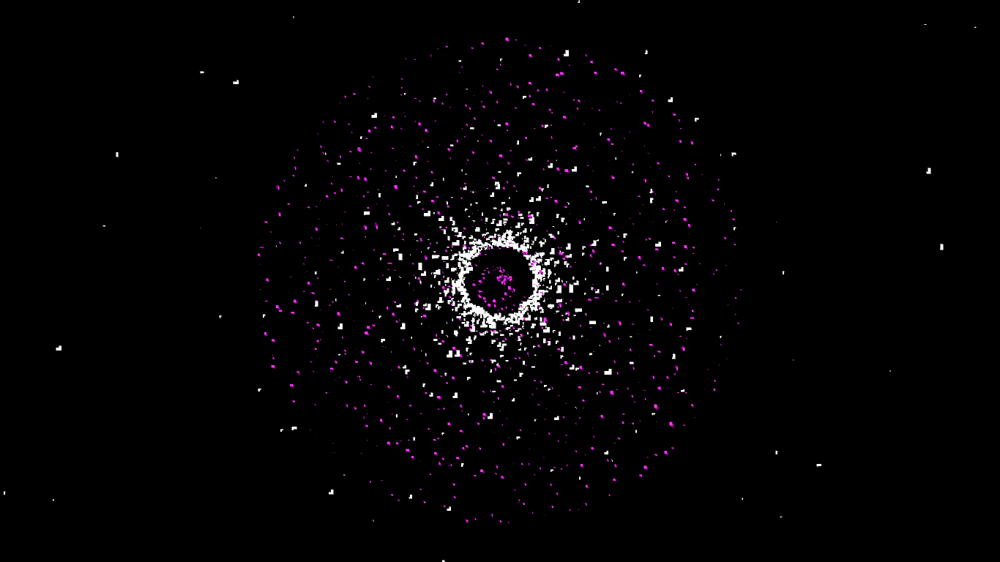
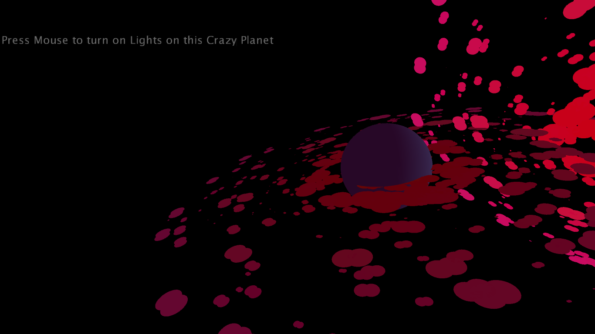
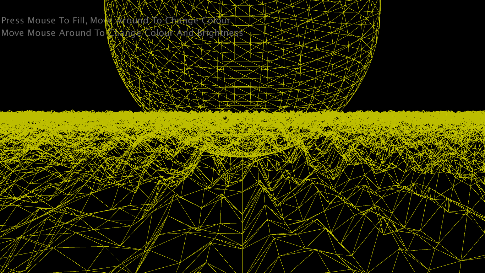

# Music Visualiser Project


[](https://www.youtube.com/watch?v=Pp4pcAGEiV0)

| Course | Name | Student Number   |       Visual       |
|------|--------|------------------|--------------------|
|TU856 | Raghd Al Juma | D19125768 |drawPlanets         |
|TU856 | Laura Andrews | D21125370 |loadingBar, Speaker |
|TU856 | Stephen Moore | D21125383 |LandScape           |


🐶🐾🎈👻👽🤡🤖  

😛🤓😁😂🤣 

😄😍🙂🤗 

😏😎💀 

🍌🦍 

🎶 


## Description of the assignment
The music visuals assignment, a program that works on visual graphics based on a pre-loaded audio. In our project, there is three scenes created by each member of the group in which each of us created visuals that react to the choosen song, "Different Heaven & EH!DE - My Heart [NCS Release]". 

These visuals were generated based on knowledge gained in classes or by internet research. Among the three scenes there are visuals that are responive to the sound either by changing colours, shapes, or size. 


## Instructions
The files for this assignemnt are located in java/src/D21125383 of the Music Visuals-2 folder. You can run our assignment from the Main.java file located in ie/tudublin. 

***Instructions:***
1. Run file assignment.java from package D21125383 in Main.java
2. Music will start playing, wait for loading bar to finish and the first visual(speaker) will play
3. Once you are done looking at the first visual you an press the key 2
4. Key 2 will then cause the next visual to play(Planets),you can press down the mouse button to light up the planets , then once done with that visual you can press Key 3
5. Key 3 will then cause visual 3(Landscape) to play, this visual allows you to move the mouse around to change the color of the stroke 
of the landscape(land and sphere), then if you press the mouse button you can fill the landscape(land and sphere) and move the mouse to change the color of the landscape
6. Reapeat instruction 1-5 to do again or you can switch the visuals as you please using the Keys 0-3 (0 being the loadingBar,1 being the Speaker, 2 being the Plants and 3 being Landscape) 

## How it works
Once the file is ran from the main, a fullscreen processing window is display where the song begins playing and a loading bar is displayed. When the loading bar is completed, the first scene is shown automatically. To see the second scene, press *num2*, and to see the third scene, press *num3*.

***The first scene:***



The first scene shows what I would describe as a speaker. The visual reacts to the audio being played, if the song goes a little quiet then the speaker retreates to the middle circle so there no colour or moving elements. When the song gets louder the colours return and the elements move outward from the circle. Calculated angles are used to help map the movements of the elements, I used the declared variables n4 and n6 as a starting point.

Code for the angles:
```Java
float angle = sin(i+n4)* 10; 
float angle2 = sin(i+n6)* 300; 
                        
float x = sin(radians(i))*(angle2+30); 
float y = cos(radians(i))*(angle2+30);
                        
float x3 = sin(radians(i))*(500/angle); 
float y3 = cos(radians(i))*(500/angle);
``` 
The colours I chose for my visual were purple, medium orchid, and white to help break the purple colours. The purple colours raditated in and out from the middle in a circle shape and the white colour radiated in and out, like mulitple diagonal lines from the middle to the edge of a rectangle.

Code for the shapes/movement:
```Java
fill(128,0,128); // purple
ellipse(x, y, heaven.left.get(i)*10, heaven.left.get(i)*10);
                        
fill(255,255,255); // white
rect(x3, y3, heaven.left.get(i)*20, heaven.left.get(i)*10);
                        
fill(186,85,211); // medium orchid
rect(x, y, heaven.right.get(i)*10, heaven.left.get(i)*10);
                        
fill(255,255,255); // white
rect(x3, y3, heaven.right.get(i)*10, heaven.right.get(i)*20);
``` 


***The second scene:***



The second scene has 3 *crazy* planets which rotate around themselves/each other. Around the planets are hoops that consist of small circles , these hoops change size and color depending of the music played, they also rotate around the planet.

In the drawPlanet method, the method takes in three parameters (x , y position of the planet and size). The planet position is set using the function translate(x, y). The color of the Planet is set using ambientLight(). this function works with (red, green blue) RGB colors to make the planets color. also directionalLight() function is used to add light to only one side of the planet to make it look more real. When code first run , the planet is darker as it is dim, when the user press the mouse, the planet lights up.

Also to make the planet rotate, the rotateX, rotateY, rotateZ functions are used and to draw the planet I used sphere() function.The hoop are drawn using for loop and circles as well as the rotate function. 

rotate speed depends on the mapped value of i in for loop from 0 to the size of the audio buffer. and the circles size and position on the x axis depends on the value in the lerpedBuffer array list.

The code:
```Java
void drawPlanet(float s, float g, float size) 
    { 

        //position of planet
        translate(s, g);
        if(mousePressed)
        {
            lights();
            ambientLight(200, 20, 250);
            directionalLight(255, 60, 126, -1, 0, 0);
        }
        
        ambientLight(100, 20, 100);
        directionalLight(51, 102, 126, -1, 0, 0);
        
        //rotate planet on x, y , z axis
        rotateY((float) (frameCount/100.0));
        rotateX((float) (frameCount/50.0));
        rotateZ((float) (frameCount/50.0));

        //fill
        fill(100);
        noStroke();

        //draw sphere
        sphere(size);

        //loop through buffer and draw the hoops around the planet
        for(int i = 0 ; i < audioBuffer.size()/2 ; i ++)
        {
            
            float c = map(i, 0, audioBuffer.size(), 0, 255);
            float f = lerpedBuffer[i] * height/2 * 4.0f;

            noStroke();
            
            //rotate the hoops around planet
            rotate(c);
            fill(s, f, c);

            //draw hoops
            circle(f*0.6f , i, f*0.4f);
            circle(f * 0.8f, i, f *0.4f);  
        }
    }
 ```   

***The third scene:***



The third scene contains a sphere floating above what I describe as a landscape, to which both will chaange stroke color by moving the mouse around the screen and if the mouse is pressed the shapes will fill and change colour aswell with the stroke if you move around the mouse. 

How the Landscape method works is first it intakes a float amp which is the average amplitude which will be used inside the method. 

Next the stroke is set so the outline of each shape can be seen(the stroke changes with mouse movement), then no fill is called to make sure there is no fill.

If statement is then called so if the mouse is clicked the sphere will fill in and change the fill colour depending on the mouse X and Y.

Placing the sphere comes next so first the Coordinates of the system are saved to the matrix stack then the sphere is translated to the position which is the middle of the screen and moved up above the land, then the previous system coordinates are popped from the stack restoring the coordinates.

Then next the 2d array is called and initialized to col and row which is the used in a nested for loop to utimatley get the z coordinate for the land which is done using noise and map function. 

No fill is then called to strip away the fill from the land and again we have a if statement tat if mouse pressed it will fill land and will change colour with the changing mouse X & Y.

Next the position of land is made using translation and rotation of the X axis, first it has the triangles start at the middle by translation then rotating the X to make the land closer to the view and finally translating the land by minus width and minus height to move it into the middle of the screen.

Next we look at how the land is made, this is through using the for loops to make the grid using the x and y coordinates then giving them depth by adding the z coordinate which is worked out earlier in the code as the 2d array, so with the combination of the foor loop and the coordinates to make the traingle strip pattern we have the land.

then this code loops over again in the draw method which constantly updates the shapes which is changing due to the sphere and z coordinate using the average amplitude which is float amp that is put into the method at the start. 
```Java
 public void LandScape(float amp){//start Landscape
        land =new float [cols][rows];
                stroke(map(mouseX, 0, width, 100, 225),map(mouseY, 0, height, 100, 225),0);
                noFill();
                if(mousePressed){//start if 
                    fill(map(mouseY, 0, width, 70, 225),0,map(mouseX, 0, height, 70, 120));
                }//end if 
                pushMatrix();
                translate(width/2, height/2-280);
                sphere(amp*1000);
                popMatrix();
                 float yoff = amp;
                for(int y =0; y < rows;y++){//start for loop y
                    float xoff = 0;
                    for(int x =0; x < cols; x++){//start for loop x
                        land[x][y] =map(noise(xoff, yoff),0,1,-50,50) ;
                        xoff +=1;
                    }//end for loop x
                    yoff+=amp;
                }//end for loop y 
                noFill();//make no fill 
                if(mousePressed){//start if
                    fill(map(mouseY, 0, width, 70, 120),0,map(mouseX, 0, height, 70, 120)); 
                }//end if 
                
                translate(width/2, height/2);//start to postion land
                rotateX(PI/2.2f);
                translate(-w/2, -h/2);//end position land
                for(int y =0; y < rows-1;y++){//start for loop to get the number of rows 
                    beginShape(TRIANGLE_STRIP);
                    for(int x =0; x < cols; x++){ //start for loop to get the number of columns
                        vertex(x*scale, y*scale,land[x][y]);
                        vertex(x*scale, (y+1)*scale, land[x][y+1]);
                    }//end for loop columns
                    endShape();
                }//end forloop  rows
    }//end Landscape

```
```
 public void LandScape(float amp){//start Landscape
        land =new float [cols][rows];
                stroke(map(mouseX, 0, width, 100, 225),map(mouseY, 0, height, 100, 225),0);
                noFill();
                if(mousePressed){//start if 
                    fill(map(mouseY, 0, width, 70, 225),0,map(mouseX, 0, height, 70, 120));
                }//end if 
                pushMatrix();
                translate(width/2, height/2-280);
                sphere(amp*1000);
                popMatrix();
                 float yoff = amp;
                for(int y =0; y < rows;y++){//start for loop y
                    float xoff = 0;
                    for(int x =0; x < cols; x++){//start for loop x
                        land[x][y] =map(noise(xoff, yoff),0,1,-50,50) ;
                        xoff +=1;
                    }//end for loop x
                    yoff+=amp;
                }//end for loop y 
                noFill();//make no fill 
                if(mousePressed){//start if
                    fill(map(mouseY, 0, width, 70, 120),0,map(mouseX, 0, height, 70, 120)); 
                }//end if 
                
                translate(width/2, height/2);//start to postion land
                rotateX(PI/2.2f);
                translate(-w/2, -h/2);//end position land
                for(int y =0; y < rows-1;y++){//start for loop to get the number of rows 
                    beginShape(TRIANGLE_STRIP);
                    for(int x =0; x < cols; x++){ //start for loop to get the number of columns
                        vertex(x*scale, y*scale,land[x][y]);
                        vertex(x*scale, (y+1)*scale, land[x][y+1]);
                    }//end for loop columns
                    endShape();
                }//end forloop  rows
    }//end Landscape
```
Scene 3 Pictures:
[(https://imgur.com/a/qbZB6HV)]


## What I am most proud of in the assignment
What I am most proud of in the assignment is the knowledge I gained from outside study that thought me how to use new things like translate, pop and push matrix etc and how this helped me to be more creative.  
